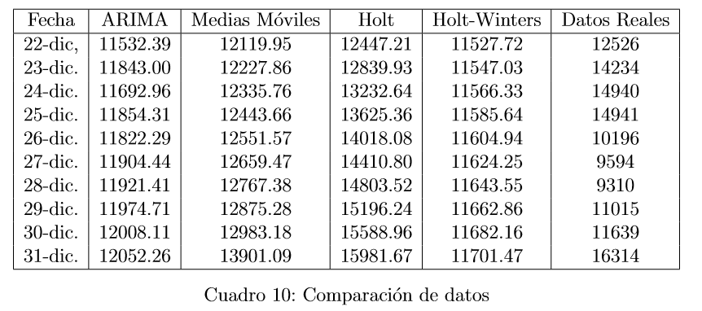

```{r setup, include=FALSE,echo=FALSE}
knitr::opts_chunk$set(echo = FALSE)
library(knitr)
```

```{r todos_pronostico, fig.align="center",out.width="600px"}
include_graphics("todos.PNG")
```

```{r comp_pron, fig.align="center",out.width="900px"}

```
