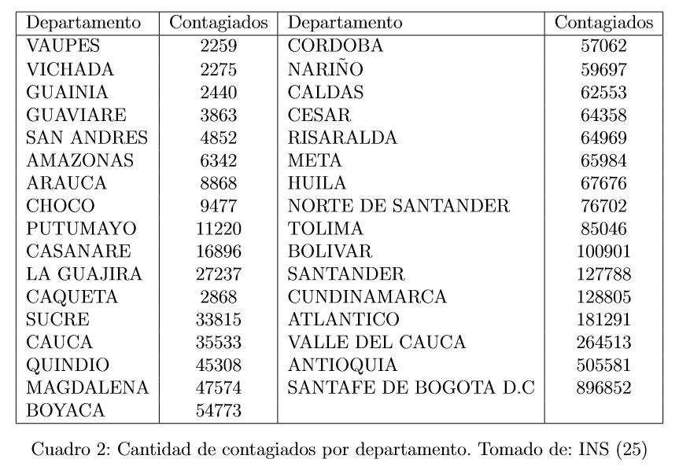
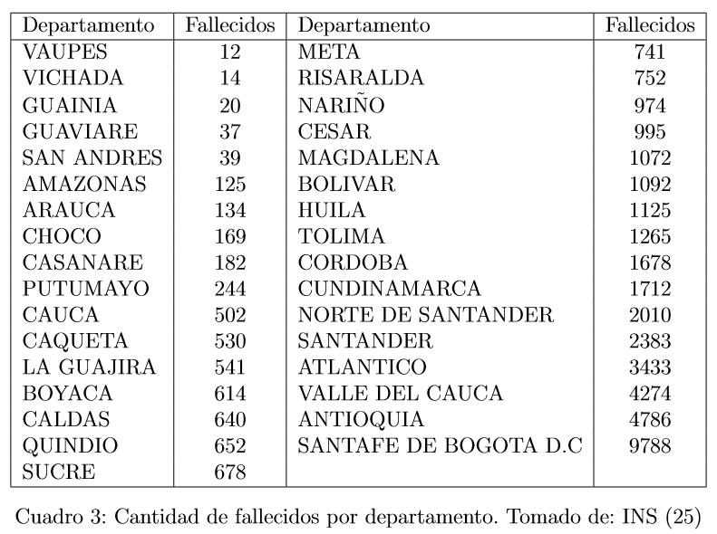

```{r setup, include=FALSE,echo=FALSE}
knitr::opts_chunk$set(echo = FALSE)
library(knitr)
```

```{r dpto_contagios, fig.align="center",out.width="700px"}

```

```{r dpto_fallecidos, fig.align="center",out.width="700px"}

```

