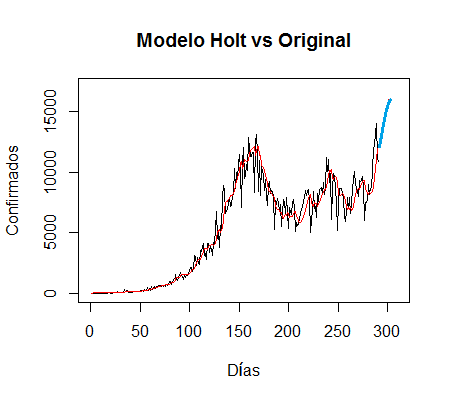

```{r setup, include=FALSE,echo=FALSE}
knitr::opts_chunk$set(echo = FALSE)
library(knitr)
```


<div style="padding: 10px; float: left; width: 45%; text-align: justify;">
```{r holt_grafica, fig.align="center",out.width="600px"}

```
</div>
<div style="padding: 10px; float: right; width: 45%; text-align: justify;">
```{r holt_pronostico, fig.align="center",out.width="300px"}
include_graphics("pronHolt.PNG")
```
</div>
