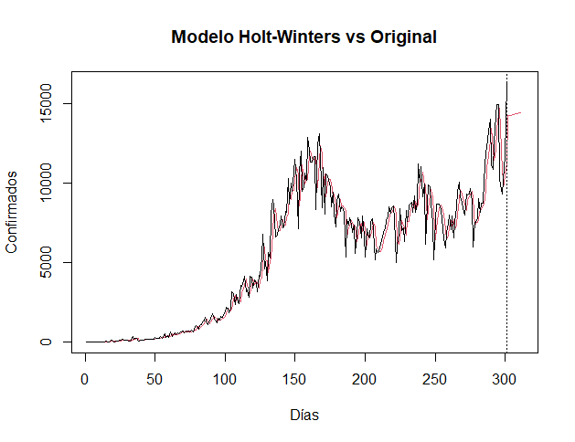
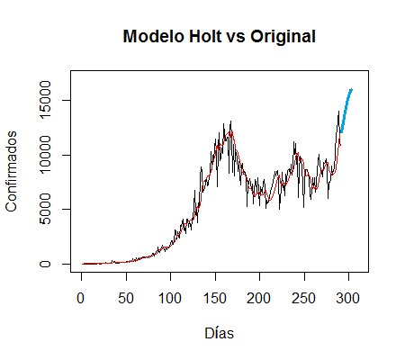
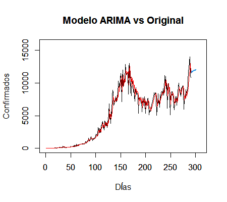
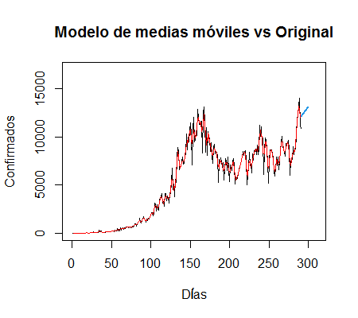

```{r setup, include=FALSE,echo=FALSE}
knitr::opts_chunk$set(echo = FALSE)
library(knitr)
```
<center>
<div style="padding: 10px; float: left; width: 45%; text-align: justify;">
```{r hw_grafica, fig.align="center",out.width="600px",echo=FALSE,message=FALSE}

```
</div>
<div style="padding: 10px; float: left; width: 45%; text-align: justify;">
```{r holt_grafica, fig.align="center",out.width="600px"}

```
</div>
<div style="padding: 10px; float: left; width: 45%; text-align: justify;">
```{r arima_grafica, fig.align="center",out.width="600px"}

```
</div><div style="padding: 10px; float: left; width: 45%; text-align: justify;">
```{r mm_grafica, fig.align="center",out.width="600px"}

```
</div>
</center>
